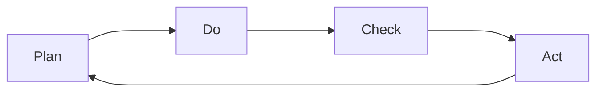

---
# You can also start simply with 'default'
theme: seriph
# random image from a curated Unsplash collection by Anthony
# like them? see https://unsplash.com/collections/94734566/slidev
# some information about your slides (markdown enabled)
title: Rapid Prototyping and API-First
class: text-center
# https://sli.dev/features/drawing
drawings:
  persist: false
# enable MDC Syntax: https://sli.dev/features/mdc
mdc: true
---

# Rapid Prototyping in Action
Ein Erfahrungsaustausch

<div class="pt-12">
  <span @click="$slidev.nav.next" class="px-2 py-1 rounded cursor-pointer" hover="bg-white bg-opacity-10">
    Press Space for next page <carbon:arrow-right class="inline"/>
  </span>
</div>

<div class="abs-br m-6 flex gap-2 items-baseline opacity-50">
    <span class="text-xs">(c) 2024 Lukas Tietenberg - GPLv3 - v2024-10-12</span>
    <a href="https://github.com/sourcefranke/prototyping-apifirst-session" target="_blank" alt="GitHub" title="Open in GitHub"
        class="text-xl slidev-icon-btn opacity-50 !border-none !hover:text-white">
        <carbon-logo-github />
    </a>
</div>


---
layout: section
---

# Letztens im Rahmen eines Vorstellungsgesprächs


---

# Programmieraufgabe

<div class="flex justify-center items-center text-4xl" style="height: 80%;">
  <span style="width: 70%;">
    "[...] erstellen Sie in z.B. Java<br>
    für einen Server einen Endpunkt<br>
    der eine Uhrzeit zurückliefert. [...]"
  </span>
</div>

---

# Annahmen zur fachlichen Umsetzung
Was nicht explizit in der Aufgabenstellung stand

<div class="flex justify-center items-center text-2xl" style="height: 80%">

- Abfrage der Uhrzeit mittels HTTP-GET Request an REST-Schnittstelle
- Rückgabe der aktuellen Uhrzeit zum Zeitpunkt des Aufrufs
- Optionale Angabe von:
  - **Datumsformat** - Default Value: "*yyyy-MM-dd'T'HH:mm:ss*"
  - **Zeitzone** - Default Value: *Greenwich Mean Time (GMT)*

</div>


---

# REST-API

<div class="grid grid-cols-2 gap-6">
<div>

<h3>OpenAPI YML (Ausschnitt)</h3>

<div class="flex justify-center" style="overflow-y: scroll; width: 100%; height: 400px">

<div style="width: 100%;">

```yaml
paths:
  /time:
    get:
      tags:
        - time
      summary: Returns current time
      description: Request the current time. Therefore, you can optionally specify date format and time zone
      operationId: getTime
      parameters:
        - name: date-format
          in: query
          description: Specify format for date and/or time
          required: false
          explode: true
          schema:
            type: string
            default: yyyy-MM-dd'T'HH:mm:ss
        - name: time-zone
          in: query
          description: Specify the time zone
          required: false
          explode: true
          schema:
            type: string
            enum:
              - Africa/Abidjan
              - Africa/Accra
              - Asia/Macau
              - Australia/Broken_Hill
              - Europe/Berlin
              - GMT
              - US/Mountain
              - US/Pacific
              - UTC
              - Zulu
            default: GMT
      responses:
        '200':
          description: successful operation
          content:
            application/json:
              schema:
                type: object
                properties:
                  time:
                    type: string
                    description: The actual time value
                  date-format:
                    type: string
                    description: The date format used
                  time-zone:
                    type: string
                    description: The time zone used
        '400':
          description: Invalid tag value
```

</div>
</div>
</div>
<div>

<h3>Swagger UI</h3>

<div class="flex justify-center">
    
</div>

<p class="text-sm flex justify-end">

Link: https://sourcefranke.github.io/clock-service-demo-api/
</p>
</div>
</div>

---

# Implementierung
Maven "pom.xml" (Ausschnitt)

<div class="flex justify-center" style="overflow: scroll; width: 100%; height: 400px">

```xml
<plugin>
    <groupId>org.openapitools</groupId>
    <artifactId>openapi-generator-maven-plugin</artifactId>
    <version>7.7.0</version>
    <executions>
        <execution>
            <goals>
                <goal>generate</goal>
            </goals>
            <configuration>
                <inputSpec>https://sourcefranke.github.io/clock-service-demo-api/swagger/api.yaml</inputSpec>
                <generatorName>spring</generatorName>
                <apiPackage>com.github.sourcefranke.clock_service_demo_impl.api</apiPackage>
                <modelPackage>com.github.sourcefranke.clock_service_demo_impl.model</modelPackage>
                <configOptions>
                    <sourceFolder>src/gen/java</sourceFolder>
                    <delegatePattern>true</delegatePattern>
                </configOptions>
            </configuration>
        </execution>
    </executions>
</plugin>
```

</div>


---

# Implementierung
Java

<div class="flex justify-center" style="overflow-y: scroll; width: 100%; height: 400px">

```java
@Component
@Slf4j
public class TimeApiDelegateImpl implements TimeApiDelegate {

    @Override
    public ResponseEntity<GetTime200Response> getTime(String dateFormat, String timeZone) {
        var time = currentTime(dateFormat, timeZone);
        var response = map(time, dateFormat, timeZone);
        log.info("GET /time?date-format={}&time-zone={}, Response: {}", dateFormat, timeZone, response);
        return ResponseEntity.ok(response);
    }

    private String currentTime(String dateFormat, String timeZone) {
        return LocalDateTime.now(ZoneId.of(timeZone))
                .format(DateTimeFormatter.ofPattern(dateFormat));
    }

    private GetTime200Response map(String time, String dateFormat, String timeZone) {
        return new GetTime200Response()
                .time(time)
                .dateFormat(dateFormat)
                .timeZone(timeZone);
    }
}
```

</div>


---
layout: section
---

# Vorgehen


---

# PDCA-Zyklus
Die Mutter aller agilen Vorgehensmodelle!




